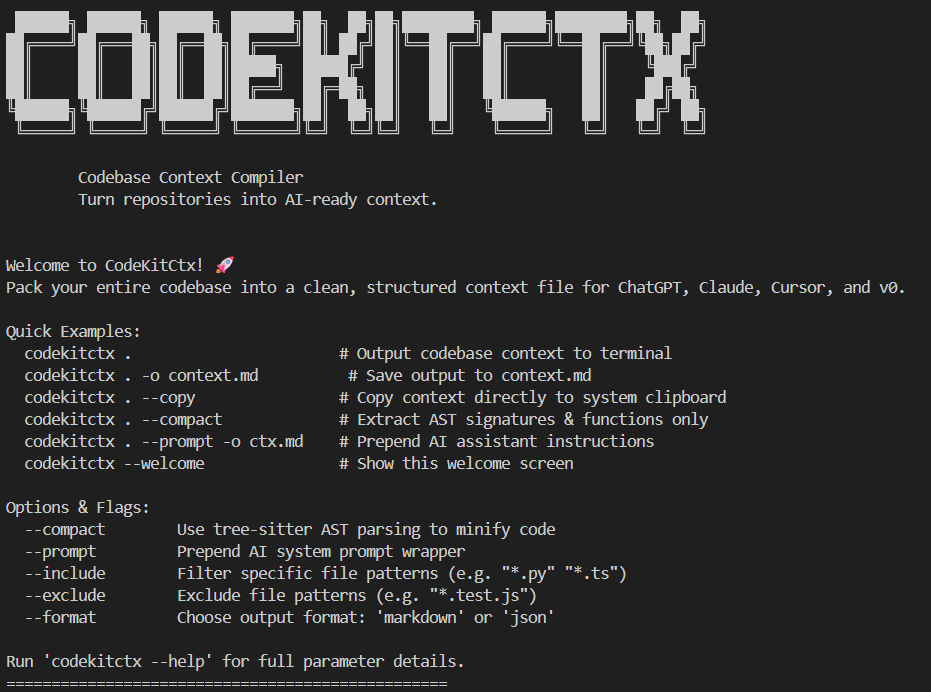

# CodeKitCtx



Codebase Context Compiler — turn repositories into AI-ready context.

Scans a codebase, computes stats and a file tree, extracts symbols via tree-sitter, and compiles everything into Markdown or JSON for LLM prompts.

## Install

```bash
python -m venv .venv
.venv\Scripts\activate   # Windows
pip install -e .
```

## CLI Usage

### Generate repository context

```bash
codekitctx .                          # Output full context to terminal
codekitctx . -o context.md            # Save to file
codekitctx . --copy                   # Copy to clipboard
```

### Generate compact context

Extracts class/function signatures instead of full file contents — great for large repos.

```bash
codekitctx . --compact
codekitctx . --compact -f json -o context.json
```

### Filter files

```bash
codekitctx . --include "*.py" "*.ts"          # Only Python and TypeScript
codekitctx . --exclude "*.test.ts" "*.spec.*" # Skip test files
codekitctx . --files src/main.py src/api.py   # Explicit files only
```

### Options

| Flag | Description |
|---|---|
| `-o, --output PATH` | Save output to a file |
| `-c, --copy` | Copy output to clipboard |
| `-f, --format` | `markdown` (default) or `json` |
| `--compact` | AST signatures instead of full source |
| `--prompt` | Prepend AI system prompt wrapper |
| `--no-tree` | Exclude directory tree |
| `--no-stats` | Exclude file statistics |
| `--include PATTERNS` | Glob patterns to include |
| `--exclude PATTERNS` | Glob patterns to exclude |
| `--files PATHS` | Explicit file paths to include |
| `--max-size BYTES` | Max file size (default 1 MB) |
| `--allow-sensitive` | Include files flagged as sensitive |
| `--welcome` | Show welcome screen |

## API Usage

Always bind to localhost for local development:

```bash
uvicorn codekitctx.server:app --host 127.0.0.1 --port 8000 --reload
```

### POST `/compile`

Returns structured JSON response.

```json
{
  "repo_path": ".",
  "tree": true,
  "stats": true,
  "compact": false,
  "format": "markdown",
  "prompt": false
}
```

### POST `/compile/raw`

Returns the compiled context as plain text.

### GET `/health`

```json
{ "status": "ok" }
```

### Auth (when API key is set)

```bash
curl -H "X-API-Key: $CODEKITCTX_API_KEY" -X POST http://127.0.0.1:8000/compile -d @payload.json
# or
curl -H "Authorization: Bearer $CODEKITCTX_API_KEY" -X POST http://127.0.0.1:8000/compile -d @payload.json
```

- No key set + localhost → open (dev mode, warning logged)
- Key set → required on `/compile*` (missing → 401, wrong → 403)
- Non-loopback bind (`--host 0.0.0.0`) + no key → **refuses to start**
- Startup check uses the **actual bind host** (uvicorn `--host` / `uvicorn.run` / `UVICORN_HOST` fallback) — not env alone

## Library Usage

```python
from codekitctx import RepoContext

ctx = RepoContext("./my-repo")
result = ctx.compile(format="markdown", compact=True)

print(result.markdown)      # Compiled output
print(result.stats)         # {total_files, total_loc, languages, ...}
print(result.tree)          # Directory tree
print(result.warnings)      # Any warnings during scan
```

### Async

```python
from codekitctx import AsyncRepoContext

ctx = AsyncRepoContext("./my-repo")
result = await ctx.compile_async()
```

## Supported Languages

Python, TypeScript, JavaScript, Rust, Go, Java, C, C++, C#, Ruby

## Security

CodeKitCtx has tiered safety guarantees depending on how you run it:

| Deployment | Safety |
|---|---|
| **Local CLI / library** | Generally safe — normal file-disclosure and dependency precautions apply |
| **Local API (127.0.0.1)** | Reasonable — unauthenticated by default, loopback-only |
| **Private network** | Requires `CODEKITCTX_API_KEY` + `CODEKITCTX_ALLOWED_ROOTS` |
| **Public internet** | **Not safe as-is** — needs reverse proxy (TLS), auth, and sandboxed workers first |

### Built-in protections

- **Path allowlist** — `repo_path` and `files` must resolve under `CODEKITCTX_ALLOWED_ROOTS` (default: CWD only). Traversal (`../`) and symlink escapes rejected.
- **Auth policy** — no key on localhost = dev mode; key set = required everywhere; non-loopback without key = refuses to start. No unauthenticated public mode.
- **Rate limiting** — 10 requests/minute per IP on `/compile*` (429 on exceed)
- **Request limits** — 1 MB request body, 10 MB output cap, per-file `max_size` (up to 50 MB)
- **Scan guardrails** — `max_files` (default 10k), `max_total_size` (default 200 MB), `max_depth` (default 32)
- **Safe mode** (default on for API) — forces `allow_sensitive=false`, active traversal/symlink checks
- **Sensitive file skipping** — `.env`, `*.pem`, `*.key`, `credentials.*`, `secrets.*` skipped by default
- **CORS** — localhost origins only by default; wildcards ignored
- **Trusted hosts** — `TrustedHostMiddleware` rejects unknown `Host` headers (default: `localhost,127.0.0.1,testserver`)
- **Timing-safe key compare** — API keys validated with `secrets.compare_digest`
- **Error hygiene** — validation errors → 400 with friendly message; unexpected errors → generic 500 (full traceback only in server logs, never echoed to client)
- **Logging** — per-request: client IP, redacted repo path, status, duration (never file contents or API keys)

### Environment variables

See [.env.example](.env.example) for all options:

- `CODEKITCTX_API_KEY` — required for non-loopback binds
- `CODEKITCTX_ALLOWED_ROOTS` — semicolon-separated path allowlist
- `CODEKITCTX_CORS_ORIGINS` — comma-separated origins
- `CODEKITCTX_SAFE_MODE` — `1` (default) / `0`
- `CODEKITCTX_ALLOWED_HOSTS` — comma-separated allowed `Host` headers

### For public deployments (out of scope, recommended)

- Terminate TLS at a reverse proxy (Caddy/nginx) and restrict source IPs
- Always set `CODEKITCTX_API_KEY` and a tight `CODEKITCTX_ALLOWED_ROOTS`
- Run the scanner in a resource-limited container (CPU/memory caps)
- Do not expose the API to untrusted users without sandboxing

## Development

```bash
pip install -e ".[dev]"   # Install with test dependencies
pytest                     # Run tests
```